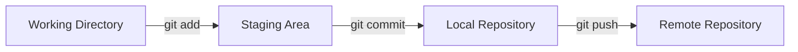
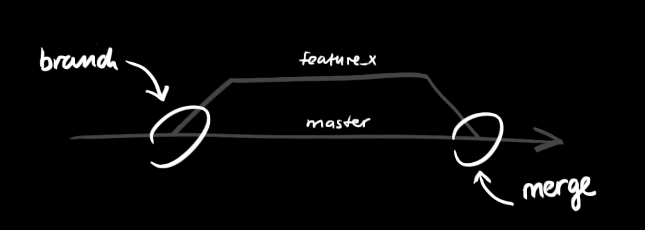

# Il Nostro Workflow Git Semplificato 🌳

## I Soli Comandi Che Useremo 🛠️

1. `git add .` - Prepara TUTTE le modifiche
2. `git commit -m "messaggio"` - Salva le modifiche
3. `git push` - Condividi su GitHub

/// to be seen lateer on when we have more branches

